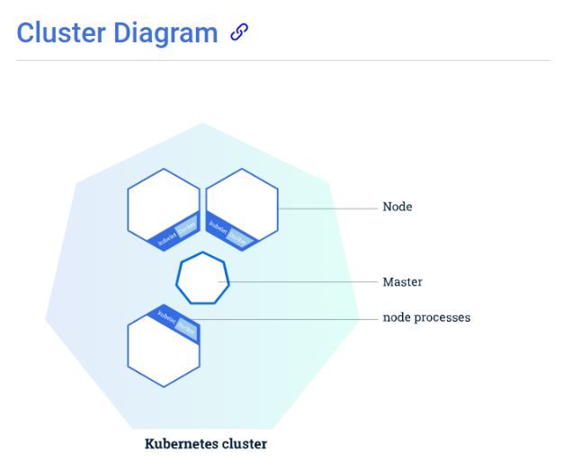

# 쿠버네티스 소개 및 설치

#### 1. 쿠버네티스 오케스트레이션

- 컨테이너의 배포 ,관리, 확장, 네트워킹을 자동화 한다.
- 오케스트레이션 툴은 쿠버네티스, 도커 스웜, Apache Mesos 등 있음.
- 쿠버네티스는 Master Node와 하나 이상의 Worker Node로 구성되어 있음.
  - 보통 Master Node는 3대 정도를 실행해서 운영하고 평소 실제 리더로서 클러스터를 관리하는 리더 Master는 1대이고 나머지 2대는 대기 중이다가 리더 Master가 장애가 발생 시 나머지 2대 중 1대로 리더역할이 넘어가게 됨.
- 쿠버네티스는 애플리케이션 컨테이너를 클러스터에 분산시키고 스케줄링하는 일을 보다 효율적으로 자동화하는 역할을 함.

#### 1-1) 쿠버네티스 용어

- 쿠버네티스 클러스터
  - 컨테이너화 된 app을 배포할 수 있게 함. 도커 이미지를 배포할 수 있게 해주는 클러스터
- Master Node(Control plane)
  - worker Node들의 상태를 관리하고 제어
  - single, multi master node 가능
  - Cluster를 관장하는 매니저
  - App의 스케줄링, 관리, 실행 멈추는 일등을 관리하며 스케일링(컨테이너를 더 많이 띄우던지 줄이던지) 새 버전을 배포해 나가는 과정 등을 관리
- worker node
  - 도커 플랫폼을 통해 컨테이너를 동작하며 실제 서비스 제공
  - 각각의 노드는 **Kubelet**을 가지고 있으며 **Kubelet**은 한 노드를 관리하기 위한 에이전트고 이 큐블렛은 쿠버네티스 Manager와 의사소통을 한다.
- Kubernetes API : App을 쿠버네티스에 배포할 때 master에게 App container을 실행하라고 한다. master는 그 컨테이너들을 cluster node들에게 실행하도록 스케줄링하게 된다. 그러면 노드는 Kubelet을 통해 master와 의사소통 하게 되고 그때 사용하는 것이 kubernetes API이다.



#### 1-2) 쿠버네티스 클러스터를 구성하는 도구

- Kubeadm

  - 쿠버네티스에서 공식 제공하는 클러스터 생성/관리 도구
  - 클러스터를 부트스트랩하는 명령이다.
- Kubespray

  - 쿠버네티스 클러스터를 배포하는 오픈소스 프로젝트
  - 다양한 형식으로 쿠버네티스 클러스터 구성가능
  - 온프레미스에서 상용 서비스 클러스터 운영 시 유용
  - 다양한 CNI(Container Network Interface) 제공
    - Container간 통신을 지원하는 VxLAN. Pod Network라고도 부름
    - 다양한 종류의 플러그 인이 존재(플라넬[flannel], 칼리코[calico], 위브넷[weavenet]) 등.
- 참고

  - kubelet : 클러스터의 모든 머신에서 실행되는 파드와 컨테이너 시작과 같은 작업을 수행하는 컴포넌트
  - kubectl : 쿠버네티스 클러스터와 통신하기 위한 커맨드 라인 도구
    - PowerShell 용 kubectl 자동완성 기능 설정 "https://kubernetes.io/ko/docs/tasks/tools/install-kubectl-windows/"
    - ```powershell
      kubectl completion powershell | Out-String | Invoke-Expression
      ```

#### 2. 쿠버네티스 설치(Windows)

- 방법1 : Docker Desktop에서 Kubernetes 설치(설정 -> Kubernetes -> Enable Kubernetes 체크)

  - 미니큐브와 달리 kubernetes-dashboard 제공하지 않음.
- 방법2 : 미니큐브 - 마스터 노드의 일부 기능과 개발 및 배포를 위한 단일 워커 노드를 제공해 간단한 쿠버네티스 환경을 제공, 쿠버네티스의 lightweight 버전이라 생각.

  "https://minikube.sigs.k8s.io/docs/start/"에서 windows용 미니큐브 설치

  - 설치 확인 명령어 : minikube version
  - 명령어 "minikube start" 입력 후 Docker Desktop에 minikube 컨테이너 실행됨.
  - 터미널 창에 클러스터 정보 확인 명령어 : kubectl cluster-info
  - 노드 정보 확인 : kubectl get nodes

```powershell
# 만약 Docker Desktop과 minikube 둘다 클러스터를 생성한 경우
kubectl config get-contexts #를 통해 현재 kubectl이 바라보는 클러스터가 어떤 것인지 확인한다. 
#CURRENT에 "*" 로 표시된 것이 kubectl이 바라보는 클러스터이다.

# 클러스터 컨텍스트 변경
kubectl config use-context docker-desktop  
```

##### 2-1) 별도 설치 없이 사용

- Play with Kubernetes 사용
  - docker 에서 제공. "https://labs.play-with-k8s.com/"
  - 4시간 사용 가능. Master, worker Node를 직접 구성한 후 사용 가능
  - Docker Hub 계정 필요
